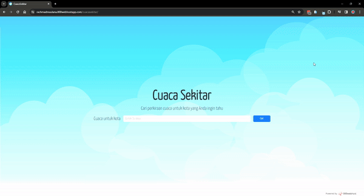

# 🌐 CuacaSekitar

---

Ini adalah repository untuk website yang dapat diakses di:  
👉 [https://rachmadmaulanaj.github.io/CuacaSekitar](https://rachmadmaulanaj.github.io/CuacaSekitar)

Website ini menampilkan **peramalan cuaca saat ini dan beberapa jam ke depan** dengan pencarian berbagai kota di seluruh dunia.

---

## 📸 Preview

---

## ✨ Fitur
- Halaman awal pencarian
- Pencarian autocomplete nama kota di dunia
- Portofolio project yang pernah saya kerjakan
- Halaman detail ramalan cuaca yang dicari
- Responsive desktop dan mobile
- Tampilan peta kota yang dicari
- Info ramalan cuaca sekarang dan 3 jam selanjutnya

> ⚠️ Data cuaca disediakan oleh [OpenWeather API](https://openweathermap.org/api)

---

## 🛠️ Teknologi / API

---

## 🔗 Link
- Website Live: [https://rachmadmaulanaj.github.io/CuacaSekitar](https://rachmadmaulanaj.github.io/CuacaSekitar)
- Repository GitHub: [https://github.com/rachmadmaulanaj/CuacaSekitar](https://github.com/rachmadmaulanaj/CuacaSekitar)